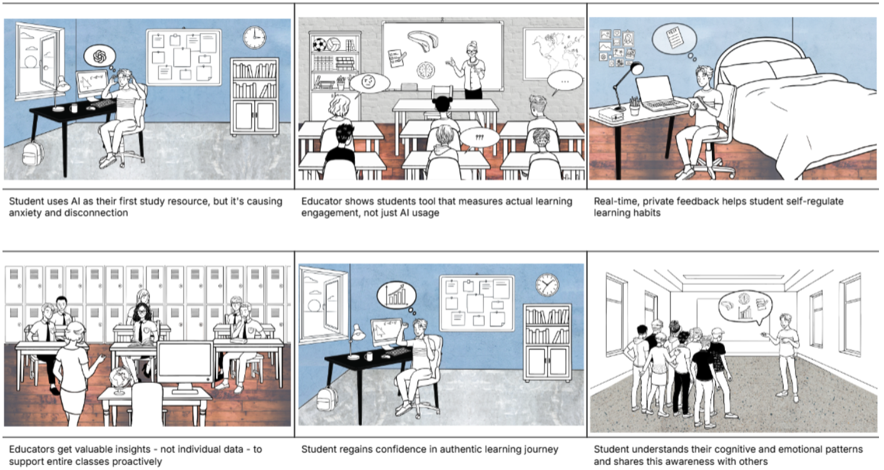

# 🧠 NeuroSync: Real-time Focus & Stress Management

<!-- HERO IMAGE: Replace 'screenshot1.png' with your best looking dashboard image -->
<div align="center">
  
  <br>
  <br>
  <p>
    <b>A real-time neurofeedback platform leveraging the Muse 2 EEG headband to optimize student focus and instructor insights.</b>
  </p>
  <p>
    
    
    
    
  </p>
</div>

---

## 📖 Overview

**NeuroSync** bridges the gap between biological signals and digital learning environments. By processing raw brainwave data, we use machine learning to classify a student's mental state (Focus, Stress, Calmness) in real-time, providing immediate feedback loops to help students get back in "the zone" and giving instructors invisible insights into classroom engagement.

## 📸 Interface & Features

<!-- FEATURE IMAGES: Replace filenames with your other 2 screenshots -->
### 1. The Student Dashboard


**For Improving Personal Focus:**
* **🎧 Adaptive Audio Feedback:** Intelligently layers binaural beats over ambient sounds when focus scores drop below baseline.
* **💡 Proactive Coaching:** Detects high stress and suggests 1-minute breathing exercises.
* **🧘 Focus Trainer:** Gamified mode to practice keeping real-time focus scores above a target threshold.
* **📊 Personal Analytics:** detailed breakdown of peak focus times and effective study durations.

### 2. The Instructor Dashboard


**For Understanding Classroom Engagement:**
* **🌡️ Class Focus Meter:** Anonymized, aggregated real-time view of the entire room's mental state.
* **😟 Stress Detection:** Identifies specific lecture moments that caused widespread confusion or anxiety.
* **📈 Longitudinal Analysis:** Tracks engagement trends over the semester to identify challenging course material.

---

## 🚀 System Architecture

The core data flow of NeuroSync operates in a low-latency loop:

1.  **Data Acquisition:** Secure connection to the Muse 2 headband via Bluetooth (BLE) to stream raw EEG data.
2.  **Backend Processing:** Python backend ingests high-frequency streams, applying noise filters and feature extraction (Alpha/Beta/Theta waves).
3.  **ML Classification:** A trained Scikit-learn model classifies the user's state in real-time.
4.  **Frontend Feedback:** React UI receives data via WebSockets for instant visualization.

## 🛠️ Tech Stack

| Component | Technology | Description |
| :--- | :--- | :--- |
| **Hardware** | **Muse 2** | EEG Headband for raw data acquisition (4-channel). |
| **Frontend** | **React.js** | Interactive dashboard for data visualization. |
| **Backend** | **Python** | Signal processing and API management. |
| **ML Engine** | **Scikit-learn** | Random Forest classifier for mental state detection. |
| **Real-time** | **WebSockets** | Low-latency data streaming from Python to React. |
| **Data Viz** | **Chart.js / D3** | Rendering live EEG waveforms and focus graphs. |

## 💻 Local Development Setup

To run this project locally, you will need a Muse 2 Headband and a Bluetooth-enabled machine.

### Prerequisites
* Node.js v18+
* Python 3.10+
* Muse LSL (Lab Streaming Layer)

### Installation

1. **Clone the repo**
   ```bash
   git clone [https://github.com/iam-tanveer/NeuroSync.git](https://github.com/iam-tanveer/NeuroSync.git)
   cd NeuroSync
